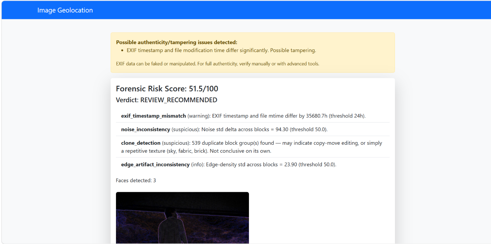
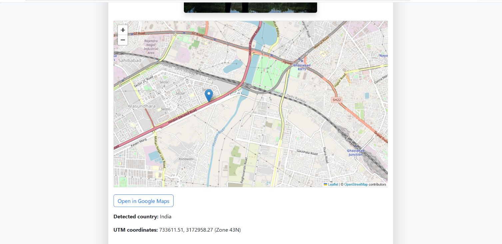
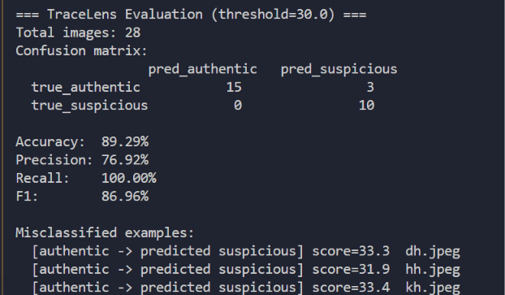

<<<<<<< HEAD
# TraceLens

An image forensics tool that analyzes uploaded photos for signs of tampering or AI generation, and shows where a photo was taken if GPS data is present.

It combines EXIF metadata analysis, pixel-level checks (noise consistency, edge artifacts, copy-move/clone detection), and AI-generation detection into a single weighted authenticity score — instead of showing a list of disconnected warnings, it gives one risk score and verdict, with every contributing signal shown as supporting evidence underneath.

## What it does

1. Upload a photo through the web interface.
2. TraceLens reads the photo's EXIF metadata and runs it through six forensic checks.
3. Each check produces a weighted "signal" (a score + evidence string), and all signals are fused into one **authenticity score (0–100)** and a verdict: `LIKELY_AUTHENTIC`, `REVIEW_RECOMMENDED`, or `SUSPICIOUS`.
4. If the photo has GPS data, it also shows the location on a map, the detected country (via reverse geocoding), and UTM coordinates.
5. An Error Level Analysis (ELA) visualization is shown alongside the score, highlighting regions that may have been edited.

## The six signals

| Signal | What it checks |
|---|---|
| EXIF consistency | Timestamp mismatches, editing-software tags, suspicious GPS, missing metadata |
| Noise inconsistency | Whether pixel noise varies unusually across the image (block-based std deviation) |
| Clone/copy-move detection | Duplicate image regions (average-hash block matching) |
| Edge artifact inconsistency | Whether edge density is unusually inconsistent across the image (Canny-based) |
| AI-generation metadata | Looks for AI tool names or generation parameters in EXIF fields |
| AI classifier API | *(implemented, not currently live — see Limitations)* Calls a hosted AI-image classifier for a pixel-content-based second opinion |

Every threshold and weight used above is stored in `config.json`, not hardcoded — see [DECISIONS.md](DECISIONS.md) for why, and for the full story of how those weights were actually chosen.

## Evaluation Results

Evaluated against a labeled test set of 28 real-world images:
- **18 authentic photos** — real, unedited photos sourced via WhatsApp and Snapchat (i.e. images that had already passed through those apps' compression/re-save pipelines, not pristine camera files)
- **10 AI-generated images** — sourced from ChatGPT, Gemini, Firefly, and Bing Image Creator ("OIG" downloads)

**Final results (after recalibration — see DECISIONS.md for the full process):**

| Metric | Score |
|---|---|
| Accuracy | 89.29% |
| Precision | 76.92% |
| Recall | 100.00% |
| F1 | 86.96% |

3 authentic images were misclassified as suspicious (false positives); 0 AI-generated images were missed (no false negatives).

**This number reflects a real, iterative calibration process, not a first-try result — see [DECISIONS.md](DECISIONS.md) for exactly what went wrong initially and how it was fixed.**

## Screenshots

### Forensic analysis result
Multi-signal fused score with individual signal breakdown and ELA visualization.


### Geolocation
Reverse-geocoded location, interactive map, and UTM coordinates from EXIF GPS data.


### Evaluation output
Real evaluation run against the labeled test set (see DECISIONS.md for the full calibration story).


## Known Limitations

- **Small test set.** 28 images is enough to catch obvious calibration problems (as it did — see DECISIONS.md) but is not a statistically rigorous benchmark. A production system would need hundreds to thousands of labeled images across more sources.
- **Precision is 77%, not 100%.** Some real, unedited photos still get flagged as suspicious. In practice this means the tool should be used as a first-pass filter for human review, not an automated final verdict.
- **Metadata-based AI detection has tool-specific blind spots.** It reliably catches Stable Diffusion-style tools that embed generation parameters in metadata, but does not detect this way for ChatGPT/Gemini/Bing-generated images, which don't leave the same traces. The `metadata_stripped_high_res` signal (flagging large images with almost no metadata at all) turned out to be the more reliable indicator for these tools specifically.
- **Pixel-level heuristics (noise, edge, clone detection) are unreliable once images have passed through app-based recompression** (WhatsApp, Snapchat, or a generator's own save/download pipeline). These signals were originally weighted much higher and had to be scaled down significantly after evaluation showed they weren't discriminating between real and AI-generated images in this dataset — both groups had been recompressed and looked similar on these checks.
- **Clone detection can false-positive on legitimate repetitive textures** (sky, fabric, brick, blurred backgrounds) — a proper fix would replace the current average-hash block matching with SIFT/ORB keypoint matching + RANSAC geometric verification.
- **The AI classifier API signal is implemented but not currently functional.** It targets Hugging Face's old Serverless Inference API endpoint (`api-inference.huggingface.co`), which Hugging Face has since restructured under their newer "Inference Providers" system. The code, config, and fail-soft error handling are complete and demonstrate the intended architecture, but the endpoint itself needs to be migrated to the new API surface to run live.
- **Results are specific to app-recompressed images** and may not generalize the same way to pristine, unprocessed camera files.

## Setup

```bash
pip install -r requirements.txt
python app.py
```

Optional — to enable the AI classifier API signal (once migrated to Hugging Face's current API): set `HF_API_TOKEN` as an environment variable or in a `.env` file (never commit this).

## Running the evaluation

```bash
python evaluate.py --data_dir test_data --threshold 30
```

Expects `test_data/authentic/` and `test_data/suspicious/` folders of labeled images. Prints accuracy/precision/recall/F1 plus a list of misclassified images.

## Project structure

```
app.py              - Flask routes, geolocation logic
forensics.py         - Forensic engine: all signal checks + score fusion
config.json           - Every threshold/weight, externalized for calibration
evaluate.py           - Evaluation harness against labeled test data
DECISIONS.md          - Design decisions, trade-offs, and the evaluation/debugging story
templates/            - upload.html, result.html
```

See [DECISIONS.md](DECISIONS.md) for the reasoning behind the architecture and a full account of the evaluation and recalibration process.
